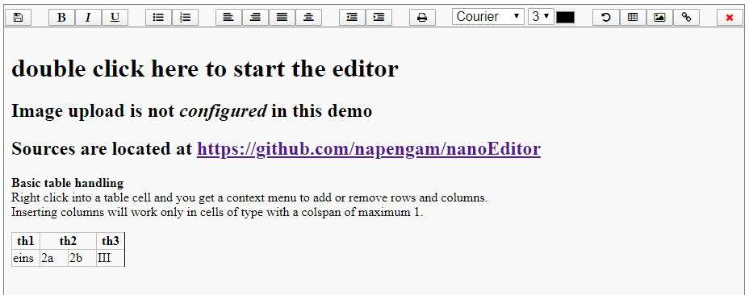
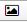
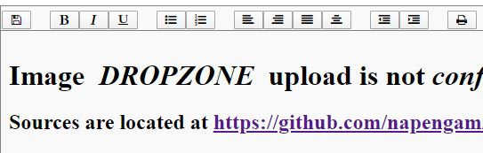
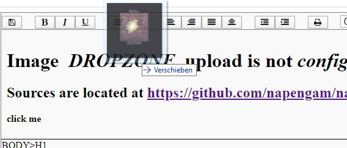
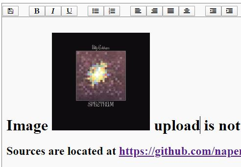
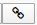

# nanoEditor
JavaScript to create a  small editor

It is not a full blown rich text editor with table support, syntax highlighting and what not. If you need 
such a beast have a look at other available editors.




A demo is located at <a href="http://hgsweb.de/nanoEditor/html/index.php">hgsweb.de/nanoEditor/html</a>

In the HTML directory there is and index.php that hopefully explains how to use the editor.
The script for the editor is located in directory js as nanoEditor.js

## Configure image upload

Tell the editor where to store pictures. If *pathToUploadDir* is not sepcified  
image upload woll not work.

```javascript
config={'imageUploadPath': 'pathToUploadDir'};  
editor=createEditor(config) 
```

Upload is handled by php script  

```php
upload_save_2.php
```

## Image Upload  

*  This button allows you to insert and uplaod images into your text.  


### how image upload works

Place the curser anywhere in your text, then press the image button.  
This will insert the word DROPZONE where the curser was located.



Now grab a picture and drop it onto the word DROPZONE. 



This  will upload and display the picture immediatly.




## Creating editing links

*  This button allows you to turn a selected text into a link.

Create a link by selecting part of your text. Keep in mind the selection  end  
must be in the same node where the selection started. 

Click the link button. This will open an input field just below the menue. There you can  
enter the URL. Click on the the save button at the right side of the input field.  
This will turn your selection into a link. if you click the link button again this will  
cancel the action.


To edit a HREF-part of a link, just click inside the link and press the link putton.  
This will load the URL into the input field.