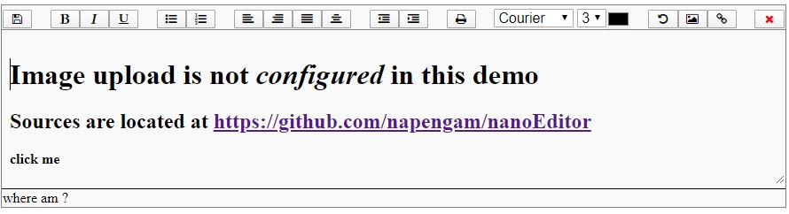

nanoEditor
==========

JavaScript to create a  small editor



A demo is located at <a href="http://hgsweb.de/nanoEditor/html/index.html">hgsweb.de/nanoEditor/html</a>

In the HTML directory there is and index.php that hopefully explains how to use the editor.
The script for the editor is located in directory js as nanoEditor.js

## Configure image upload

Tell the editor where to store pictures. If *pathToUploadDir* is not sepcified  
image upload woll not work.

```javascript
config={'imageUploadPath': 'pathToUploadDir'};  
editor=createEditor(config) 
```

Upload is handled by php script  

```php
upload_save_2.php
```

## Image Upload  

*  This button allows you to insert and uplaod images into your text.  


### how image upload works

Place the curser anywhere in your text, then press the image button.  
This will insert the word DROPZONE where the curser was located.


Now grab a picture and drop it onto the word DROPZONE. 


This  will upload and display the picture immediatly.


## Creating links

*  This button allows you to turn a selected text into a link.  